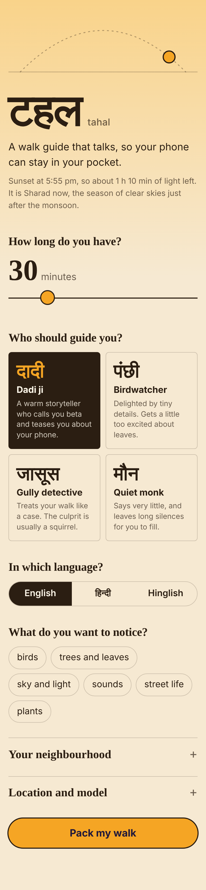
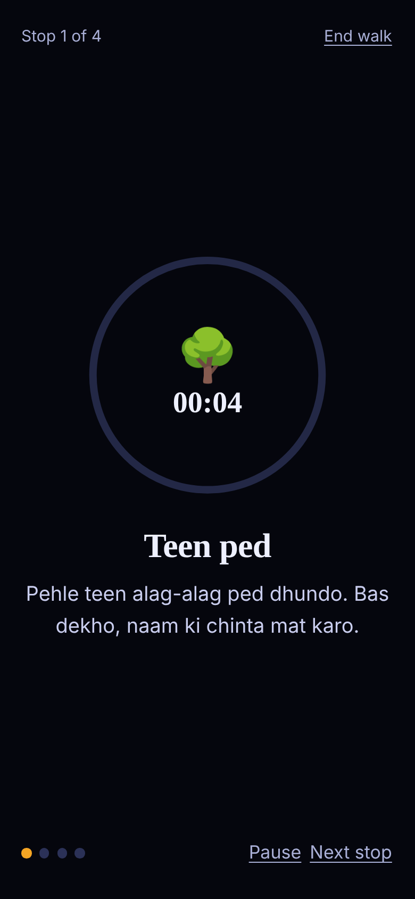

# Tahal (टहल) 🌿

**A voice-guided walk companion that lets you put your phone away.**

*Tahal* (Hindi for "a stroll") creates custom, voice-guided walks tailored to your time, mood, and local environment. Pick a guide persona, select your language, set your duration, and let AI generate a personalized walk. Once started, Tahal speaks each stop aloud so your phone can stay safely in your pocket.

| Pack | Walk | Pocket |
|:---:|:---:|:---:|
|  |  |  |

---

## 🌟 Key Features

- 🎧 **Hands-Free Walking**: Auto-advances through stops with voice narration and gentle audio chimes.
- 🔒 **Pocket-Safe Screen**: Dims to a black screen after 12 seconds to prevent accidental touches. Press-and-hold to wake.
- 🗣️ **Multiple Personas & Languages**: Choose from *Dadi ji*, *Birdwatcher*, *Gully Detective*, or *Quiet Monk* in English, Hindi, or Hinglish.
- 🗺️ **Personalized Landmarks**: Add real spots from your neighborhood—Tahal will never invent fake places.
- ☀️ **Sky & Season Aware**: Adapts theme and prompts based on your local sun position and Indian season (*ritu*).
- 🔒 **100% Private & Local**: Runs on your machine. Your notes, places, and walk journals stay private.

---

## 🚀 Quick Start

### 1. Requirements
- [Node.js](https://nodejs.org) (v18 or higher)
- *(Optional)* [Ollama](https://ollama.com) for local AI generation

### 2. Run the Server
No `npm install` needed (zero external npm dependencies)!

```bash
# Start the server directly
node server.js
```
Open **[http://localhost:3000](http://localhost:3000)** in your browser.

> 💡 **Demo Mode**: If Ollama is not installed or running, Tahal automatically runs in Demo Mode with built-in sample walks.

---

## 🤖 Using Local AI with Ollama

To generate unique AI walks powered by Gemma:

1. Download and install [Ollama](https://ollama.com).
2. Start Ollama and download the model:
   ```bash
   ollama serve
   ollama pull gemma3:4b
   ```
3. Refresh [http://localhost:3000](http://localhost:3000). Tahal will automatically detect Ollama!

---

## 📱 Mobile Setup

1. **Connect Phone to Laptop**:
   - On Android (via USB): Run `adb reverse tcp:3000 tcp:3000` and open `http://localhost:3000` in Chrome on your phone.
   - Or open `http://<your-laptop-ip>:3000` on your local Wi-Fi.
2. **Pack Before You Walk**: Generate your walk while connected. Playback works offline!
3. **Speech & Audio**: Make sure your phone has text-to-speech enabled in system settings for Hindi/English voice output.

---

## ⚙️ Configuration (Environment Variables)

| Variable | Default | Description |
|---|---|---|
| `PORT` | `3000` | Web server port |
| `OLLAMA_URL` | `http://127.0.0.1:11434` | Ollama service URL |
| `MODEL` | `gemma3:4b` | Default AI model name |
| `DEMO_MODE` | `0` | Set `1` to enable offline sample walk fallback |
| `NO_WEATHER` | unset | Set `1` to disable weather API requests |

---

## 🧪 Testing & Development

Run the dependency-free unit test suite:

```bash
npm test
```

### Dev Shortcuts (Query Parameters)
- `?fast=1`: 1 minute equals 2 seconds (great for fast testing).
- `?phase=night`: Forces dark night sky theme.

---

## 🛠️ Built With

- **Backend**: Plain Node.js (`http`, `fs`, `path`) — zero npm dependencies.
- **Frontend**: Vanilla JavaScript, HTML5, Vanilla CSS, Web Speech API, Web Audio API, Canvas.

---

## 📄 License

[MIT](LICENSE)

